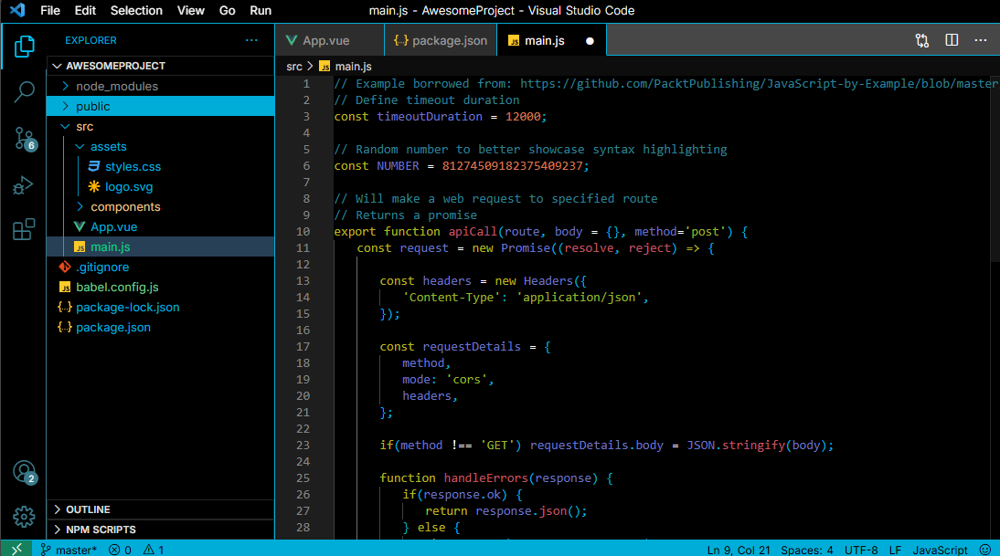

# PolyGopher — VS Code Theme

**PolyGopher** is a vibrant Visual Studio Code theme inspired by the gradient transitions between **Google’s signature colors** and the **iconic Gopher blue** from the Go programming language — crafted with love by **Safak**.  

---

## ✨ Features

- 🎨 **Colorful & vibrant** syntax highlighting  
- 🌗 Works great in **both dark & light UI settings**  
- 💻 Optimized for **frontend, backend, and Go developers**  
- 🧩 Balanced contrast for long coding sessions  
- 🚀 Designed to make your code **look beautiful & readable**  

---

## 📦 Installation

1. Open **Extensions** sidebar in VS Code  
2. Search for **PolyGopher**  
3. Click **Install**  
4. Open the Command Palette and select: